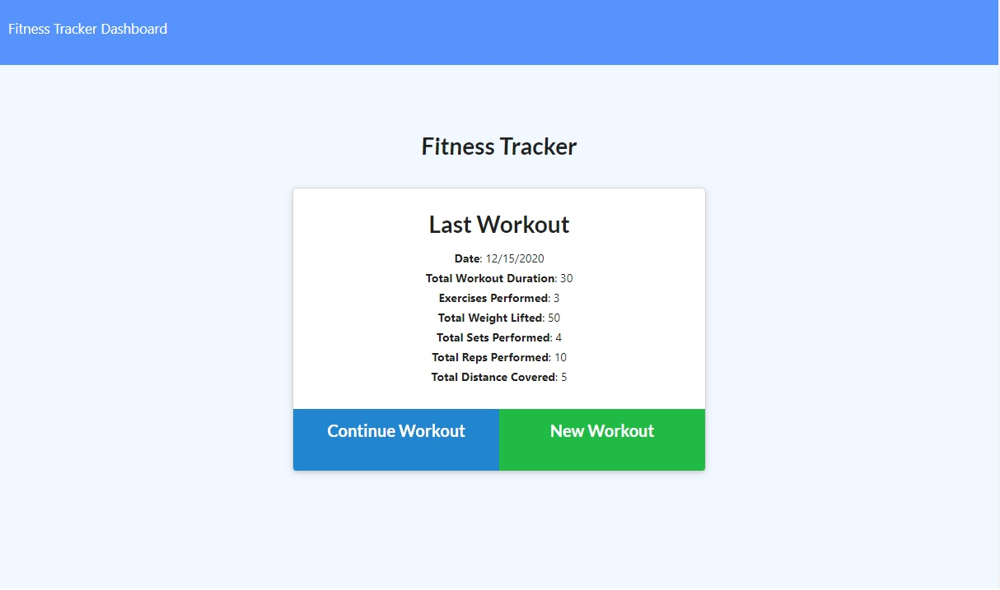

# Fitness Workout Tracker
Fitness-Tracker

Here is a link to the Heroku deployed webpage: [https://fitness-workout-tracker-besh.herokuapp.com/]

Project Description:
A fitness app that allows the user to view, create, and track daily workouts. The user is able to log multiple exercises in a given day and also go back and update the workout. The user is able to track the name, type, weight, sets, reps and duration of each exercise. Cardiovascular exercises show the distance traveled in miles.

## Application Features:

  * Add exercises to a previous workout plan.

  * Add new exercises to a new workout plan.

  * Dashboard display with grapgh and a chart

  ## Programs
 * HTML, CSS, Javascript, 
 * Node.js, Express.js, 
 * MongoDB, Mongoose, Bootstrap, JSON
